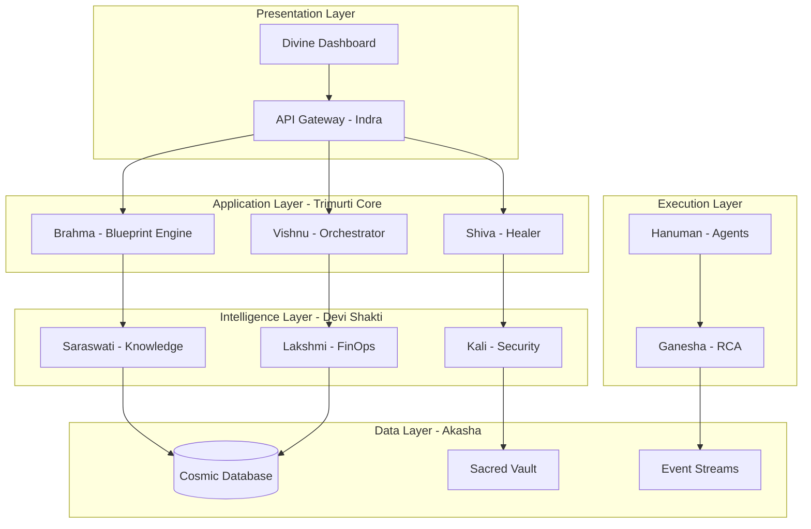

# 🌌 AetherEdge - Divine AI Infrastructure Framework

*Sanatana Dharma Inspired Enterprise Infrastructure Automation Platform*

## 📖 Project Overview

AetherEdge is an enterprise-grade AI-driven infrastructure automation platform that embodies the eternal principles of Sanatana Dharma. Each module represents a divine archetype, ensuring technology remains balanced, purposeful, and self-sustaining.

### 🕉️ Divine Architecture - The Trimurti Framework

| Deity | Module | Function | Technology Stack |
|--------|--------|----------|------------------|
| **Brahma** - Creator | `brahma-blueprint` | AI Blueprint Generator | FastAPI, GPT Models, IaC Templates |
| **Vishnu** - Preserver | `vishnu-orchestrator` | Policy & Orchestration Engine | Kubernetes, ArgoCD, OPA |
| **Shiva** - Transformer | `shiva-healer` | AI Healing & Auto-remediation | ML Models, Ansible, Auto-scaling |
| **Saraswati** - Wisdom | `saraswati-knowledge` | ML Knowledge Graph & Model Repository | MLflow, Vector DB, Knowledge Base |
| **Lakshmi** - Prosperity | `lakshmi-finops` | FinOps Intelligence Engine | Cost Analytics, Budget Optimization |
| **Kali** - Protector | `kali-security` | Security & Threat Enforcement | Zero-Trust, mTLS, Threat Detection |
| **Hanuman** - Executor | `hanuman-agents` | Distributed Agent Network | Multi-platform Agents, Task Execution |
| **Ganesha** - Obstacle Remover | `ganesha-rca` | Root Cause Analytics Engine | Event Correlation, Problem Resolution |

## 🏗️ Enterprise Architecture



## 🚀 Quick Start

### Prerequisites
- Python 3.11+
- Node.js 18+
- Docker & Kubernetes
- PostgreSQL 15+
- Redis 7+

### Installation

```bash
# Clone the cosmic repository
git clone https://github.com/your-org/aetheredge.git
cd aetheredge

# Initialize the divine environment
./scripts/cosmic-bootstrap.sh

# Deploy to Kubernetes
helm install aetheredge ./helm/aetheredge
```

## 📁 Project Structure

```
aetheredge/
├── 📚 docs/                           # Sacred Documentation
├── 🎨 ui/                            # Divine Dashboard (React)
├── 🔥 api-gateway/                   # Indra - Central Gateway
├── 🌟 modules/
│   ├── brahma-blueprint/             # Creation Engine
│   ├── vishnu-orchestrator/          # Preservation Engine  
│   ├── shiva-healer/                 # Transformation Engine
│   ├── saraswati-knowledge/          # Wisdom Engine
│   ├── lakshmi-finops/              # Prosperity Engine
│   ├── kali-security/               # Protection Engine
│   ├── hanuman-agents/              # Execution Engine
│   └── ganesha-rca/                 # Problem Resolution Engine
├── 🛠️ infrastructure/               # Terraform & Ansible
├── 📊 monitoring/                   # Observability Stack
├── 🔐 security/                     # Zero-Trust Framework
├── 🧪 tests/                        # Divine Test Suites
├── 📦 helm/                         # Kubernetes Charts
├── 🔄 pipelines/                    # CI/CD Workflows
└── 📋 scripts/                      # Automation Scripts
```

## 🎯 Key Features

### 🧠 AI-Driven Intelligence
- **Intent-to-Infrastructure**: Natural language to IaC conversion
- **Predictive Healing**: AI-powered failure prediction and auto-remediation
- **Cost Optimization**: ML-driven resource optimization
- **Security Analytics**: Behavioral threat detection

### 🛡️ Enterprise Security
- **Zero-Trust Architecture**: Every connection verified
- **mTLS Everywhere**: End-to-end encryption
- **Policy-as-Code**: Automated compliance enforcement
- **Immutable Audit**: Blockchain-style audit trails

### 🌐 Multi-Cloud Harmony
- **Cloud Agnostic**: AWS, Azure, GCP, On-premises
- **Hybrid Orchestration**: Seamless workload migration
- **Edge Computing**: Distributed agent network
- **Disaster Recovery**: Cross-region replication

### 📈 Observability & Analytics
- **Golden Signals**: Unified metrics across all layers
- **Distributed Tracing**: End-to-end request correlation
- **Real-time Dashboards**: Live system visualization
- **Predictive Analytics**: Future state modeling

## 🔧 Development

### Local Development Setup

```bash
# Install dependencies
pip install -r requirements.txt
npm install

# Start local services
docker-compose up -d

# Run in development mode
./scripts/dev-start.sh
```

### Running Tests

```bash
# Unit tests
pytest tests/unit/

# Integration tests
pytest tests/integration/

# Security tests
./scripts/security-scan.sh

# Load tests
k6 run tests/load/api-load-test.js
```

## 📊 Monitoring & Observability

- **Prometheus**: Metrics collection
- **Grafana**: Visualization dashboards
- **Jaeger**: Distributed tracing
- **ELK Stack**: Centralized logging
- **AlertManager**: Intelligent alerting

## 🛡️ Security & Compliance

- **NIST 800-53**: Security framework compliance
- **SOC 2 Type II**: Audit trail and controls
- **ISO 27001**: Information security management
- **GDPR**: Data protection compliance
- **Zero-Trust**: Never trust, always verify

## 🤝 Contributing

Please read our [Contributing Guidelines](CONTRIBUTING.md) and [Code of Conduct](CODE_OF_CONDUCT.md).

## 📄 License

This project is licensed under the MIT License - see the [LICENSE](LICENSE) file for details.

## 🙏 Acknowledgments

*"धर्मो रक्षति रक्षितः" - Dharma protects those who protect Dharma*

Built with divine inspiration from Sanatana Dharma principles, ensuring technology serves humanity with wisdom, prosperity, and protection.

---

**Made with 🕉️ by the AetherEdge Team**
